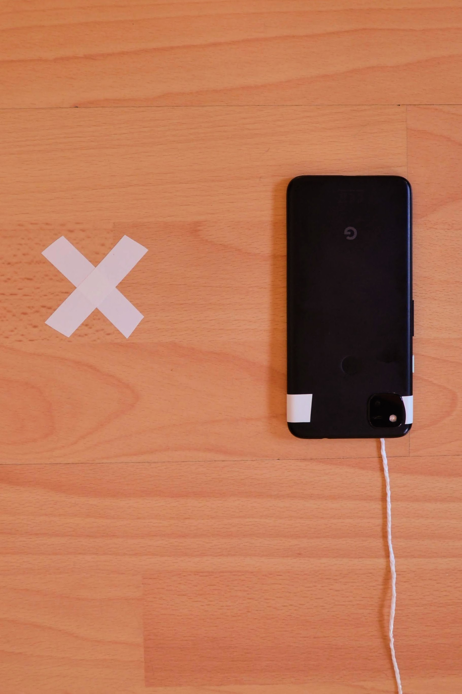
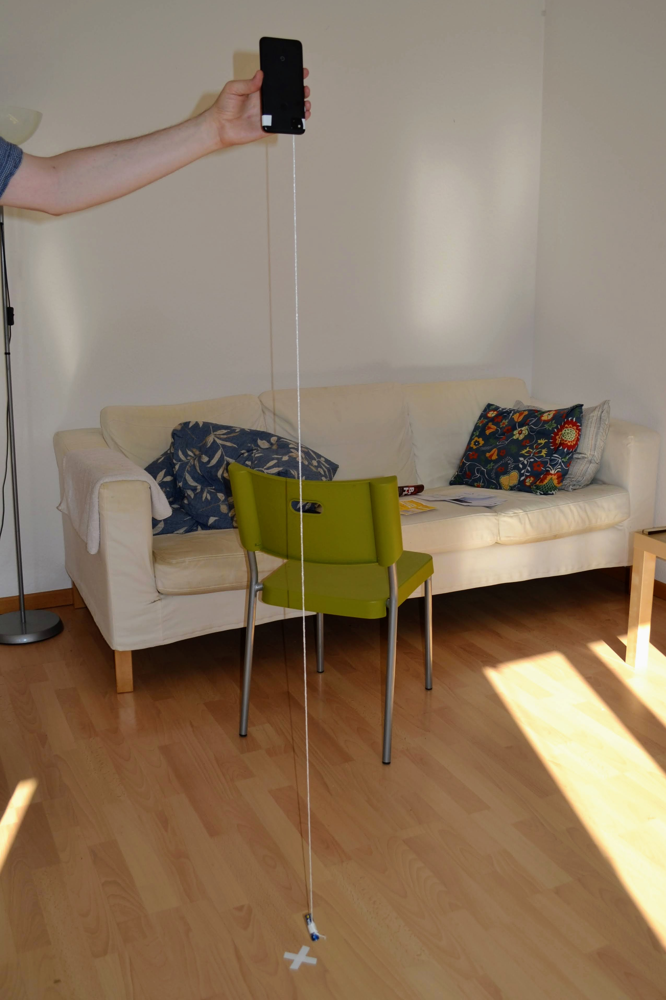
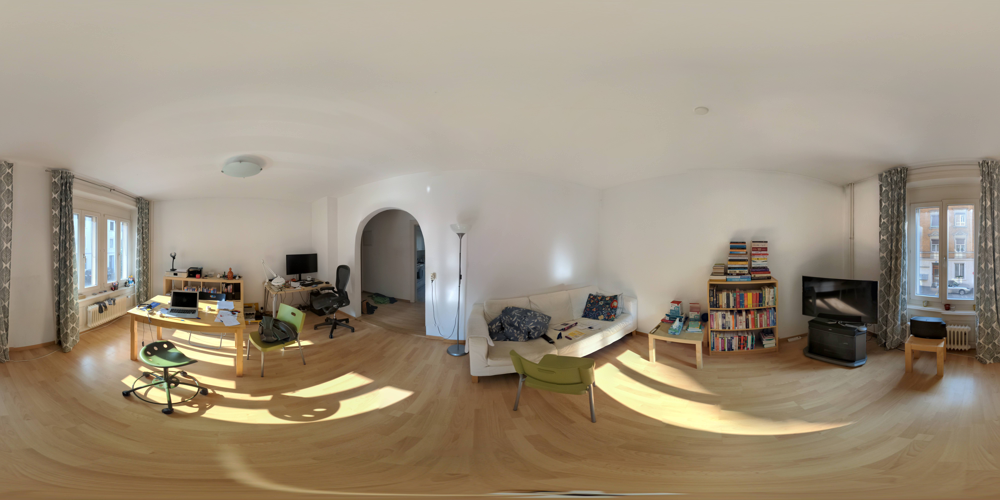
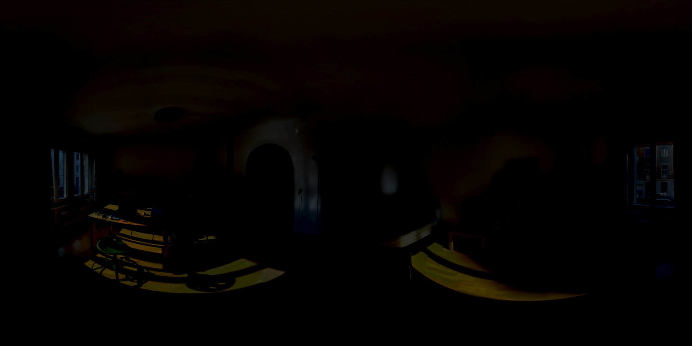
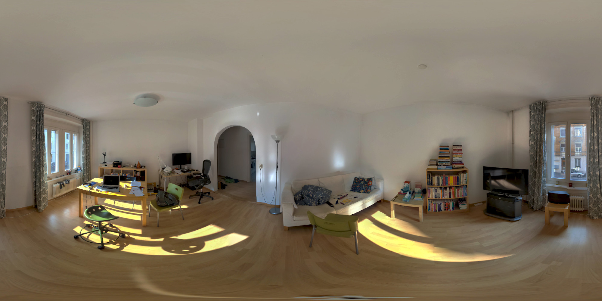
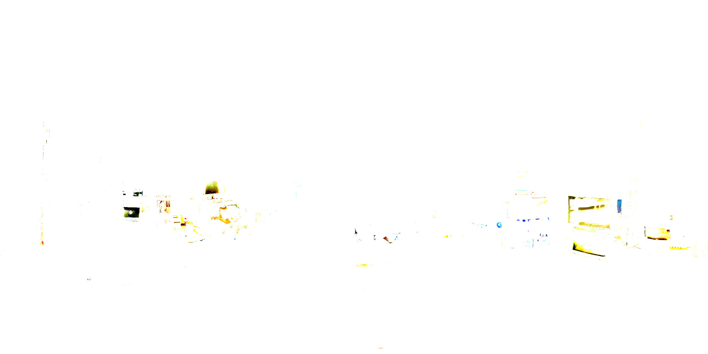
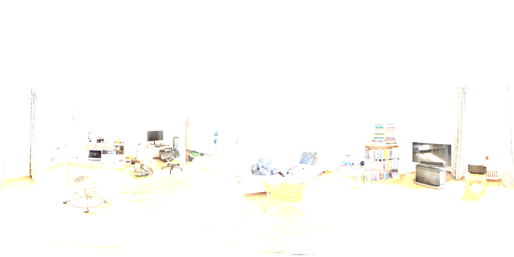

Photosphere
===========

My initial attempts at photospheres in small enclosed spaces weren't very impressive. Using a virtual tripod, called a [Philopod](https://www.philohome.com/tripod/shooting.htm), as suggested in this Photography StackExchange [answer](https://photo.stackexchange.com/a/87775/99736) greatly improved things.

Using insulation tape, I marked a cross on the floor at the point that I wanted to rotate about and attached a weight (I used a dead battery) by a string to my smartphone.

Ideally, the string should be attached to the phone just behind the main camera - the idea is to maintain the weight just above the marked point on the floor throughtout the process of shooting the photos for the photosphere. With this setup, the camera sensor essentially stays at a fixed point in space throughout the process.

If the string is too long, then it's hard to take the downward pointing photos, in particular the one where you photograph the cross on the floor. And if it's too short then the upward pointing photos become difficult.

When taking the photo of the cross, its necessary to hold the phone as far a way as possible in order not to end up with your disembodied feet in this picture.

Throughout the process, try to maitain a consistent position relative to the phone, i.e. shuffle round with the phone for each shot rather than twisting or turning it to take the next shot.

<table>
<tr>
<td>

_Main camera_  
<a href="camera-back.jpg"></a>

</td>
<td>

_Front of phone_  
<a href="camera-front.jpg"></a>

</td>
<td>

_Virtual tripod_  
<a href="plumb-line.jpg"></a>

</td>
</tr>
</table>

_Resulting photosphere_  


Viewing photospheres
--------------------

It took me a while to work out how to embed a photosphere properly in a web page such that you can interact with it. Eventually, I found this [page](https://ourcodeworld.com/articles/read/843/top-7-best-360-degrees-equirectangular-image-viewer-javascript-plugins) from Carlos Delgado that has lots of good pointers.

In particular these ones looked interesting:

* Equilinear panorama [demo](https://threejs.org/examples/#webgl_panorama_equirectangular) in Three.js
* [Pannellum](https://pannellum.org/documentation/examples/simple-example/)
* [Photo Sphere Viewer](https://photo-sphere-viewer.js.org/)
* [Marzipano](https://www.marzipano.net/demos.html)
* [Panolens](https://pchen66.github.io/Panolens/#Example)

You can see the above photosphere displayed using Pannellum [here](https://george-hawkins.github.io/photosphere/photosphere-pannellum.html) and using Photo Sphere Viewer [here](https://george-hawkins.github.io/photosphere/photosphere-psv.html).

360&deg; cameras
----------------

The Google camera app creates a fairly good photosphere by stiching together individual photos. However, you can still notice tears in the image at various points.

For a better result you need a proper 360&deg; camera. The cheapest that produce acceptable results seem to be the entry level models in the [Ricoh Theta](https://theta360.com/en/) range.

For best results you need to combine such a camera with a tripod that's designed to appear as little as possible in the resulting image - i.e. much smaller legs than a standard tripod.

At the moment (late 2021), a suitable combo might be a [Ricoh Theta SC2 camera](https://www.digitec.ch/en/s1/product/ricoh-360-videokamera-theta-sc2-blau-30p-4k-action-cameras-12396853) (around &euro;250) and a [Ricoh TD-2 stand](https://www.digitec.ch/de/s1/product/ricoh-theta-td-2-aluminium-stativ-13894881) (around &euro;90) or the similarly priced [Manfrotto VR Pixi Evo Kit](https://www.digitec.ch/de/s1/product/manfrotto-vr-pixi-evo-kit-aluminium-stativ-8609378).

Ricoh also have far more expensive premium end camera but in this price category, it seems that most people are using Insta360 cameras. E.g. the Insta360 [ONE R 360 Edition](https://www.bhphotovideo.com/c/product/1573317-REG/insta360_cinakgp_d_one_r_360_edition.html). Oddly, there are various variants of the ONE R, e.g. the 4K and 1-inch ones, that support taking 360&deg; images.

Both the cheaper Ricoh cameras and the more expensive Insta360 cameras support HDR - which is a big plus over photosphere images created by the Google camera app if you plan to use the images for HDRIs (if your source images are single exposure images then you obviously can't call the resulting HDRI a true HDRI).

There are lots of cheaper cameras from China - e.g. the [Xanes 360&deg;](https://www.banggood.com/360-Mini-WiFi-Panoramic-Video-Camera-2448P-30fps-16MP-Photo-3D-Sports-DV-VR-Video-And-Image-ABS-p-1059241.html) - but image quality and support may not be what you expect.

Videos
------

Blender Daily - [Easy HDRI creation with just a phone](https://www.youtube.com/watch?v=Aco0UDxL6rA).

Clinton Jones (Pwnisher) - [Custom HDRIs for photorealism](https://www.youtube.com/watch?v=MASbLjQ9S_Y) - note that Clint constructs his HDRI in Photoshop from multiple images taken at different exposures with a Insta360 ONE R. So even though the ONE R lists HDR as a feature, Clint doesn't seem to be using this.


Reconstructing HDR data using deep learning
-------------------------------------------

An intriguing idea is to try and reconstruct HDR data from a single LDR image using AI. There's quite a lot of work on trying to do this and I tried out the code related to a number of papers on the Awesome Deep HDR [page](https://github.com/vinthony/awesome-deep-hdr).

As is usually the case with such code (written for a paper and rarely seriously maintained once the paper is published), it was difficult to get them running.

However, I did manage to get results with the [code](https://github.com/alex04072000/SingleHDR) accompanying the [CVPR 2020](https://cvpr2020.thecvf.com/) paper "Single-Image HDR Reconstruction by Learning to Reverse the Camera Pipeline".

On my Ubuntu 20.04 box I...

**1.** Cloned the repository:

```
$ git clone git@github.com:alex04072000/SingleHDR.git
```

**2.** Installed the OpenEXR dependencies:

```
$ sudo apt install openexr libopenexr-dev
```

**3.** Created and activated a virtual environment:

```
$ cd SingleHDR
$ python3 -m venv env
$ source env/bin/activate
$ pip install --upgrade pip
```

**4.** Installed the necessary Python packages:

```
$ pip install numpy scipy tensorflow==1.12.3 tensorlayer==1.11.1 OpenEXR opencv-python
```

**5.** Downloaded and unpacked the predefined model data (using the download link in the main [`README`](https://github.com/alex04072000/SingleHDR/blob/master/README.md)):

```
unzip ~/Downloads/ckpt.zip 'ckpt_deq_lin_hal_ref/*'
```

We just need the fine-tuned model data, i.e. `ckpt_deq_lin_hal_ref`.

**6.** Ran the code to construct HDRs for images found in the `imgs` subdirectory (there's one test image there):

```
$ python test_real_refinement.py --ckpt_path ckpt_deq_lin_hal_ref/model.ckpt --test_imgs ./imgs --output_path output_hdrs
```

That's it - the test input image is `imgs/00000.png` and the resulting output HDR is `output_hdrs/00000.hdr`.

### Viewing the results

The input image can be viewed with the standard system image viewer:

```
$ eog imgs/00000.png 
```

But viewing the `.hdr` file requires something like `pfsv` from the [pfstools](http://pfstools.sourceforge.net/) package:

```
$ sudo apt install pfsview
```

Open the original and the generated `.hdr` side-by-side:

```
$ pfsv imgs/00000.png &
$ pfsv output_hdrs/00000.hdr &
```

Then use the `-` and `=` keys to adjust the exposure up and down and see how the two images repond differently.

### Results

You can see the results [here](https://george-hawkins.github.io/photosphere/photosphere-hdr.html) for my photosphere, shown above, using [hdrpng.js](https://github.com/enkimute/hdrpng.js). However, it's probably best to pull [`photosphere-4000x2000.hdr`](photosphere-4000x2000.hdr) into Blender to really work with it properly.

For a more capable web-based HDR viewer, see [OpenHDR Viewer](https://viewer.openhdr.org/).

### Comparison

Here are some comparison images generated using `pfsv`.

| Details | Original LDR | Reconstructed HDR |
|---------|--------------|-------------------|
| -0.45 f&#8209;stops -1.5D 0.03162 |  | 
| 0 f&#8209;stops 0D 1 |  | 
| +0.45 f&#8209;stops +1.5D 31.62 |  | 

### Notes

It took a bit of experimenting to find a combination of specific Python package versions that worked with this code. It depends on TensorFlow version 1 rather than the current version 2 and the [TensorLayer](https://github.com/tensorlayer/tensorlayer) dependency buts further constraints on what will work.

In the end, I found TensorFlow 1.12.3 in combination with TensorLayer 1.11.1 were the latest versions that would work. Hence, the `pip install` line used above.

I froze the resulting versions for all the dependencies like so:

```
$ pip freeze > singlehdr-requirements.txt
```

So instead of the `pip install` line up above, you can get exactly the set of dependency versions that I used with:

```
$ pip install -r path/to/singlehdr-requirements.txt
```

By looking at these dependencies, one can see that Python 3.6 was the most recent expected Python version at the time.

I used Python 3.6.13 (installed with [pyenv](https://github.com/pyenv/pyenv) which lets you easily manage multiple Python versions) but only because I'd experienced issues using later versions of Python with some of the other projects linked to from the Awesome Deep HDR page. This code may well work fine with later versions of Python.

### Memory usage

I have a system with 32GiB of RAM. However, this doesn't seem to be enough to handle the 8000x4000 photosphere images that the Google camera app on my Pixel 4a produces.

When I tried running the code on such images, it blew up with:

```
./imgs2/photosphere-8000x4000.png
terminate called after throwing an instance of 'std::bad_alloc'
  what():  std::bad_alloc
Aborted (core dumped)
```

Working with PNG or JPG made no difference.

I experimented and reduced the photosphere size - 2000x1000 worked without problem while 4000x2000 worked but produced warnings:

```
./imgs2/photosphere-4000x2000.png
2021-10-16 20:03:01.705197: W tensorflow/core/framework/allocator.cc:122] Allocation of 3529506816 exceeds 10% of system memory.
2021-10-16 20:03:54.152975: W tensorflow/core/framework/allocator.cc:122] Allocation of 4429185024 exceeds 10% of system memory.
2021-10-16 20:03:55.224794: W tensorflow/core/framework/allocator.cc:122] Allocation of 4435544064 exceeds 10% of system memory.
2021-10-16 20:04:06.658640: W tensorflow/core/framework/allocator.cc:122] Allocation of 4429185024 exceeds 10% of system memory.
```

And it really needs as much of the 32GiB as you can give it - if I have anything else (like Chrome) running then the [OOM killer](https://www.kernel.org/doc/gorman/html/understand/understand016.html) kills the task before it can complete.

If you monitor it, you can see that most of the time it uses far less memory - it only very temporarily bounces up to consume nearly the entire system memory, it would be interesting to see what's happening during these moments and see if they could be optimized to use less memory.

On an Intel i5-10400 with 12 cores, it takes about 2m 30s to process a 4000x2000 image.

### GPU usage

TensorFlow will work with your GPU if you have one - however, if you have a reasonably up-to-date system then it will be near impossible to get the 1.12.3 version of TensorFlow, used here, to work with anything other than your CPU.
