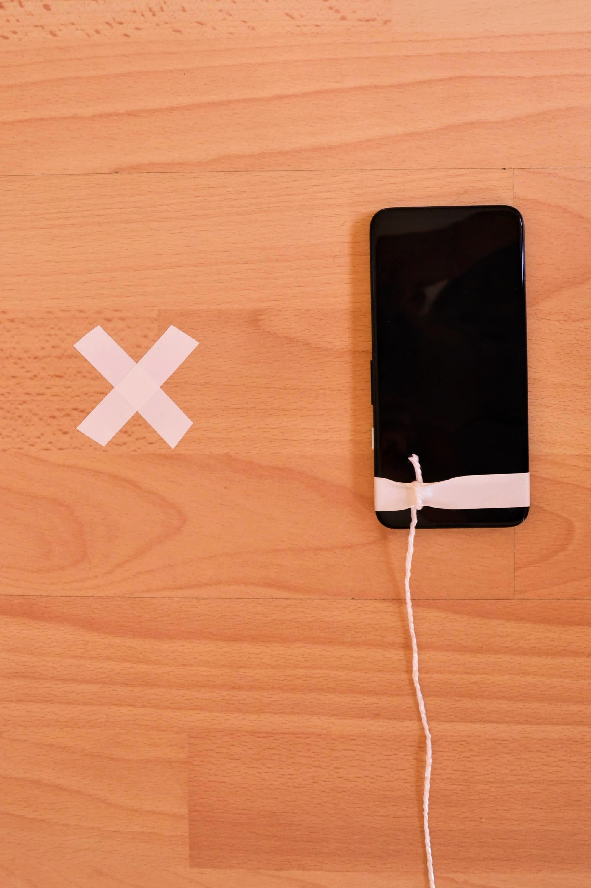

Photosphere
===========

My initial attempts at photospheres in small enclosed spaces weren't very impressive. Using a virtual tripod, called a [Philopod](https://www.philohome.com/tripod/shooting.htm), as suggested in this Photography StackExchange [answer](https://photo.stackexchange.com/a/87775/99736) greatly improved things.

Using insulation tape, I marked a cross on the floor at the point that I wanted to rotate about and attached a weight (I used a dead battery) by a string to my smartphone.

Ideally, the string should be attached to the phone just behind the main camera - the idea is to maintain the weight just above the marked point on the floor throughtout the process of shooting the photos for the photosphere. With this setup, the camera sensor essentially stays at a fixed point in space throughout the process.

If the string is too long, then it's hard to take the downward pointing photos, in particular the one where you photograph the cross on the floor. And if it's too short then the upward pointing photos become difficult.

When taking the photo of the cross, its necessary to hold the phone as far a way as possible in order not to end up with your disembodied feet in this picture.

Throughout the process, try to maitain a consistent position relative to the phone, i.e. shuffle round with the phone for each shot rather than twisting or turning it to take the next shot.

_Main camera_  

_Front of phone_  

_Virtual tripod_  

_Resulting photosphere_  

Viewing photospheres
--------------------

It took me a while to work out how to embed a photosphere properly in a web page such that you can interact with it. Eventually, I found this [page](https://ourcodeworld.com/articles/read/843/top-7-best-360-degrees-equirectangular-image-viewer-javascript-plugins) from Carlos Delgado that has lots of good pointers.

In particular these ones looked interesting:

* Equilinear panorama [demo](https://threejs.org/examples/#webgl_panorama_equirectangular) in Three.js
* [Pannellum](https://pannellum.org/documentation/examples/simple-example/)
* [Photo Sphere Viewer](https://photo-sphere-viewer.js.org/)
* [Marzipano](https://www.marzipano.net/demos.html)
* [Panolens](https://pchen66.github.io/Panolens/#Example)

You can see the above photosphere displayed using Pannellum [here](https://george-hawkins.github.io/photosphere/photosphere-pannellum.html) and using Photo Sphere Viewer [here](https://george-hawkins.github.io/photosphere/photosphere-psv.html).
