Steps in Blender
================

I created an image with elements of different degrees of mirrored-ness as a basis for experimenting with HDRIs.

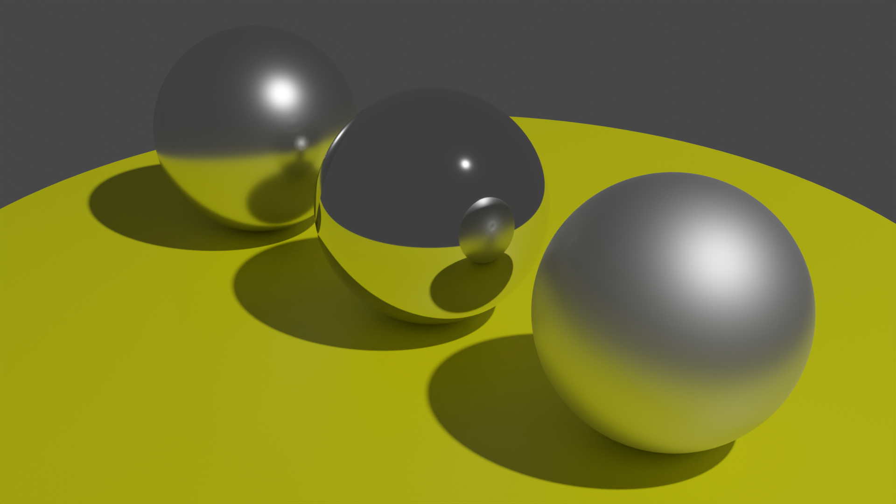

The above scene was created, starting from the default new scene in Blender, as follows:

* Removed the cube.
* Added a 1m radius circle with fill type n-gon.
* Created a UV sphere with radius 0.2m and z 0.2m (so it sits on the circle). Set its shading to smooth.
* Duplicated the sphere twice, adjusting the x of one to -0.5m and the x of the other to 0.5m.
* Added a subdivision modifier (leaving the defaults as they are) to the disc and the three spheres. I didn't apply the modifiers (we don't need extra geometry). Without it the sharp edges of the outlines of the spheres are very obvious in the final render.
* Added materials to the disc and the three spheres.
* Set the base color of the disc to yellow - RGB (0.8, 0.8, 0)
* Set the metallic value of all three spheres to 1.
* Left the roughness of the rightmost sphere at 0.5, changed it for the leftmost to 0.25 and for the middle one to 0.05. I found setting the roughness to 0 just looked weird, more reflective than the best mirrors you see in daily life, hence the 0.05.
* Set the render engine to Cycles (and the device to GPU compute).
* Got the camera where I wanted it (just locked camera to view, zoomed in and dragged down a little to center things better).
* Ticked denoising in the data section of the layer properties.
* Went to the compositing workspace, ticked _use nodes_, added a _filter / denoise_ node between the render and composite nodes and wired image, alpha and depth from the render node to, respectively, the image, normal and albedo inputs of the denoise node and wired its image output to the image input of the composite node.

I just described most of the step above very briefly as they're very basic operations. I described the denoising steps in more detail as I'm not so familiar with them (but they greatly improve the end result). For more details (and screenshots) for this step, search for "noise" in my notes [here](https://github.com/george-hawkins/blender-donut-notebook/blob/master/README.md).

Adding the HDRI
---------------

Go to the _shading_ workspace and in the _shading editor_ change the shader type from _object_ to _world_. Add a _texture / environment texture_ node, open your HDRI and wire things up as shown:

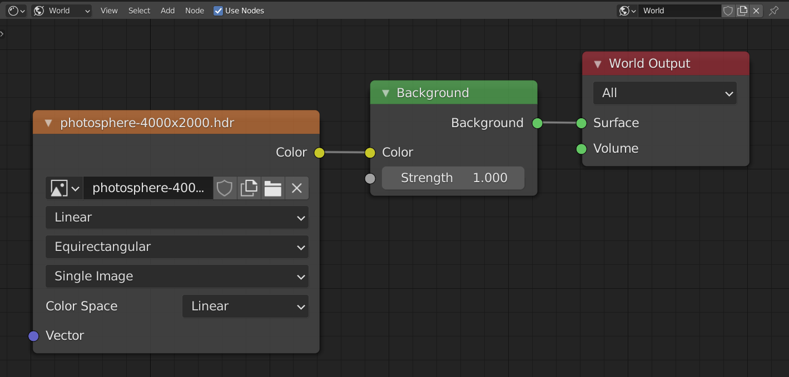

This _doesn't_ affect the background if the shading for the 3D viewport is _material preview_. For that you'd need to open _viewport shading_, click the cog, add your `.hdr` file as a _light_, then click the sphere (the studio light) and select your newly added light:

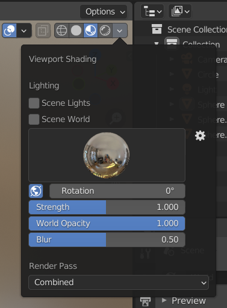

But you don't need to do this if you're not concerned about _material preview_.

Now, switch to the layout workspace and to rendered viewport shading and you get a picture something like this (I removed my yellow disc as this makes for more interesting images):

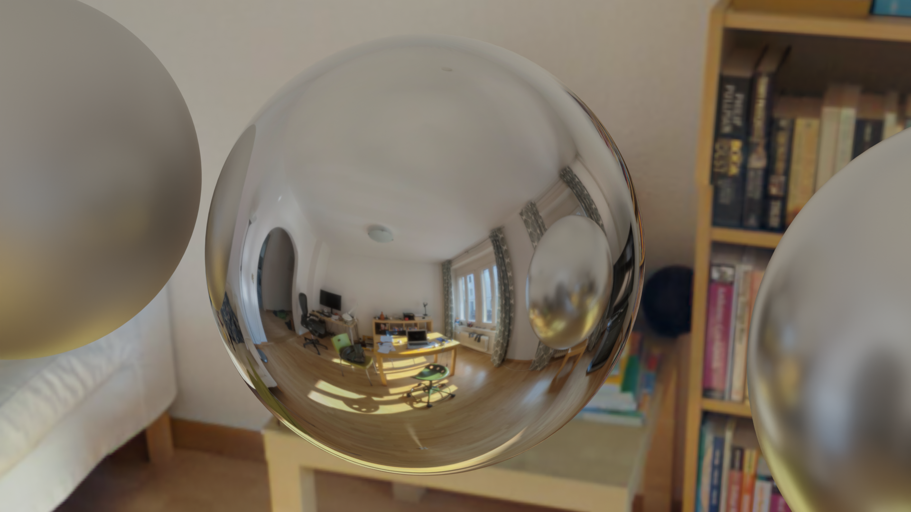

It's a little confusing at first - it's important to realize that the HDRI isn't really a 3D scene, it's just a texture painted onto the environment containing your scene. Your scene is at the center of the original photosphere - there's no way that I can move my scene such that e.g. the spheres sit on the table - the table simply doesn't exist as a 3D object that I can move towards.

If I wanted my spheres on the table then I'd have to create a photosphere that was centered on the desired point on the table. This would be quite hard without a proper 360&deg; camera (and some creativity with tripods etc.).

HDR and LDR environment textures
--------------------------------

Try experimenting with the original LDR photosphere `.jpg` and the `.hdr` one with reconstructed HDR data - add in another environment texture node but this time load the original LDR `.jpg`. Switch back and forward between using one or other node as the input to the background node.

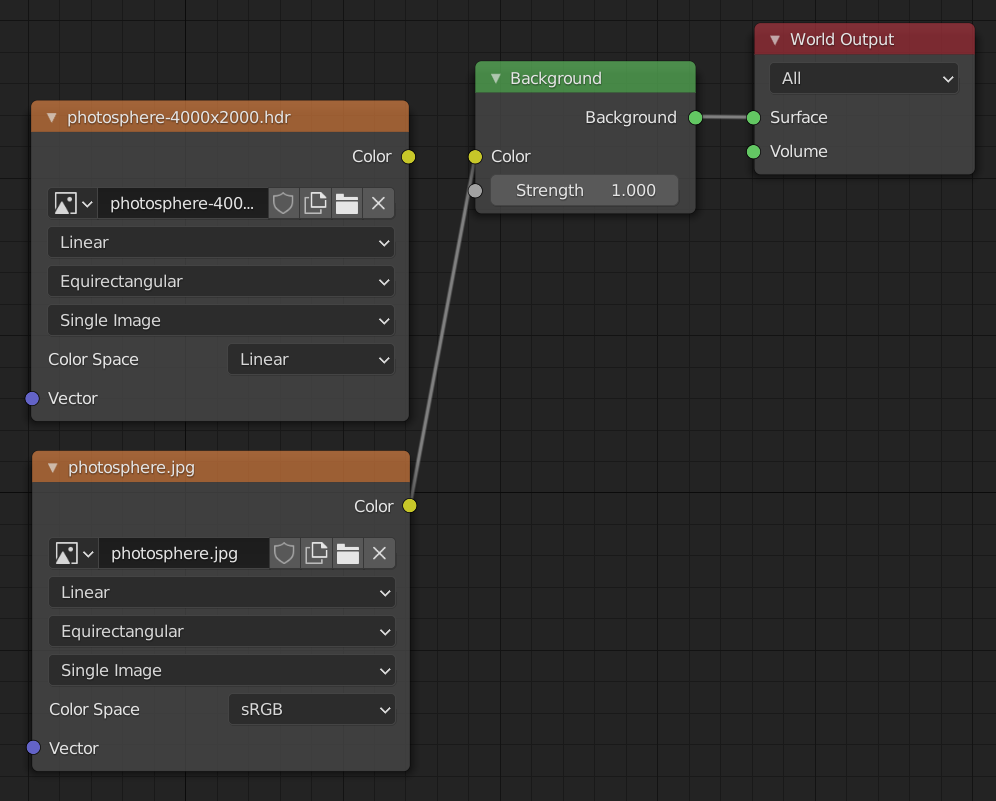

Then in the layout workspace, go to the _render properties_ tab and in the _color management_ section adjust the exposure value up and down.

| Exposure | LDR | HDR |
|----------|-----|-----|
| -7 | 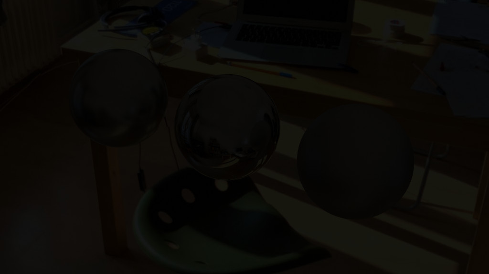 | 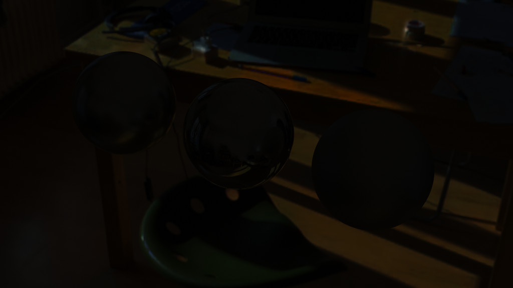
| 0 | 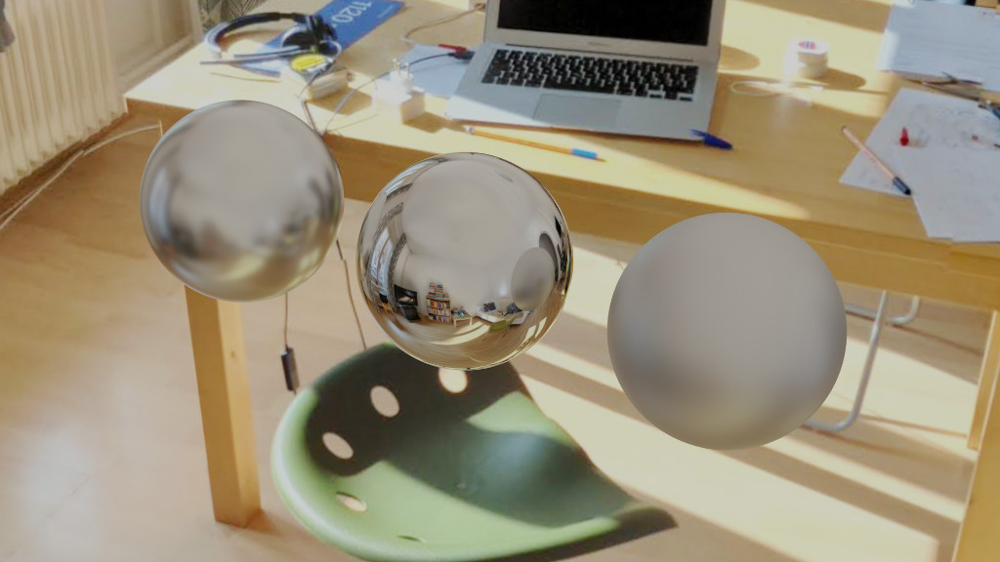 | 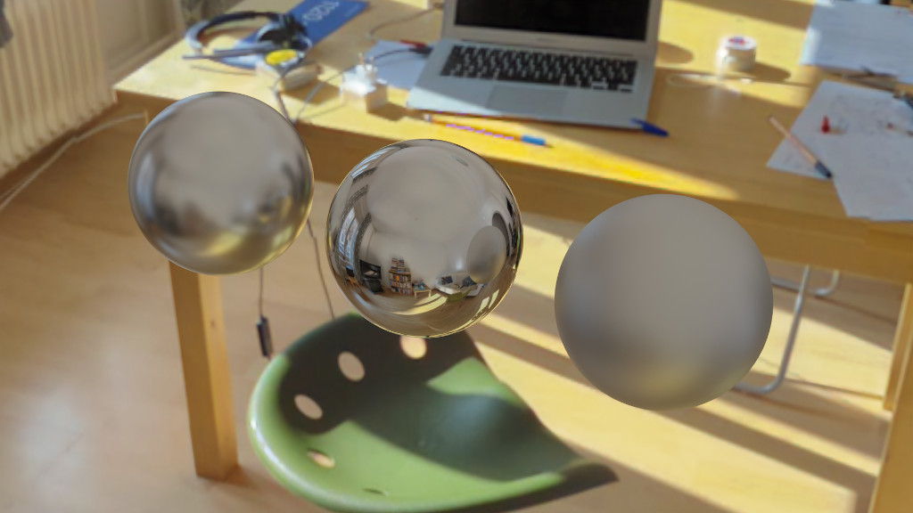
| 7 | 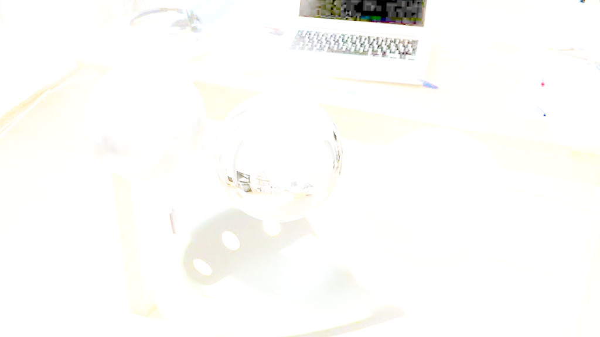 | 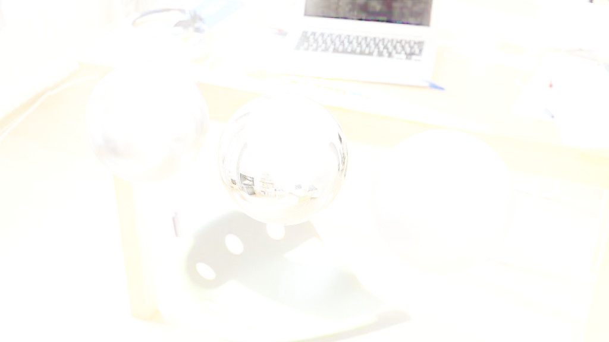

Rotating the environment texture
--------------------------------

You can rotate the environment texture relative to your scene - add an _input / texture coordinate_ node and a _vector / mapping_ node and wire them up as shown. I adjusted the z value in the rotation section, as shown, and moved the camera to get one of the windows directly behind the balls.

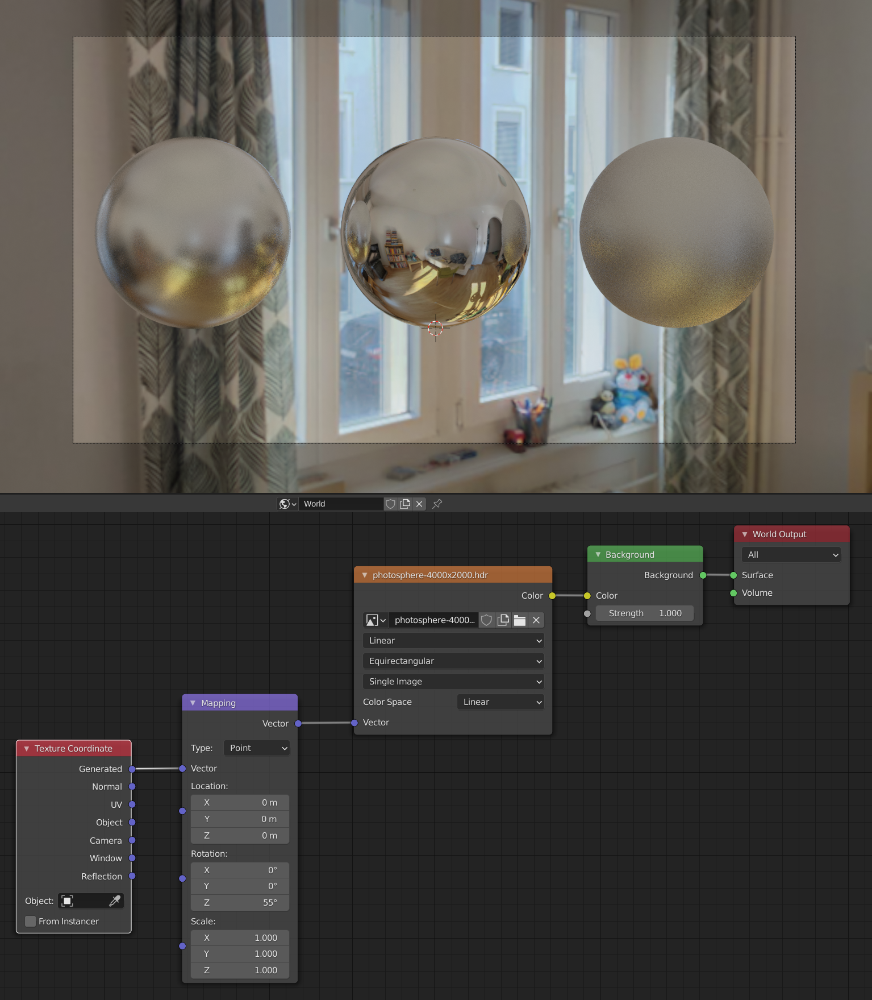

Adjusting anything other than the z rotation value probably isn't very useful but try it (making sure you're not currently looking at the world thru the camera). Adjusting x and y results in tilting your photosphere world relative to your scene world. Adjusting location can work a little but quickly results in massive distortion (as noted already, the photosphere isn't a real 3D scene). And scale is pointless unless you want to squash or expand one of the dimensions of your photosphere relative to the others.